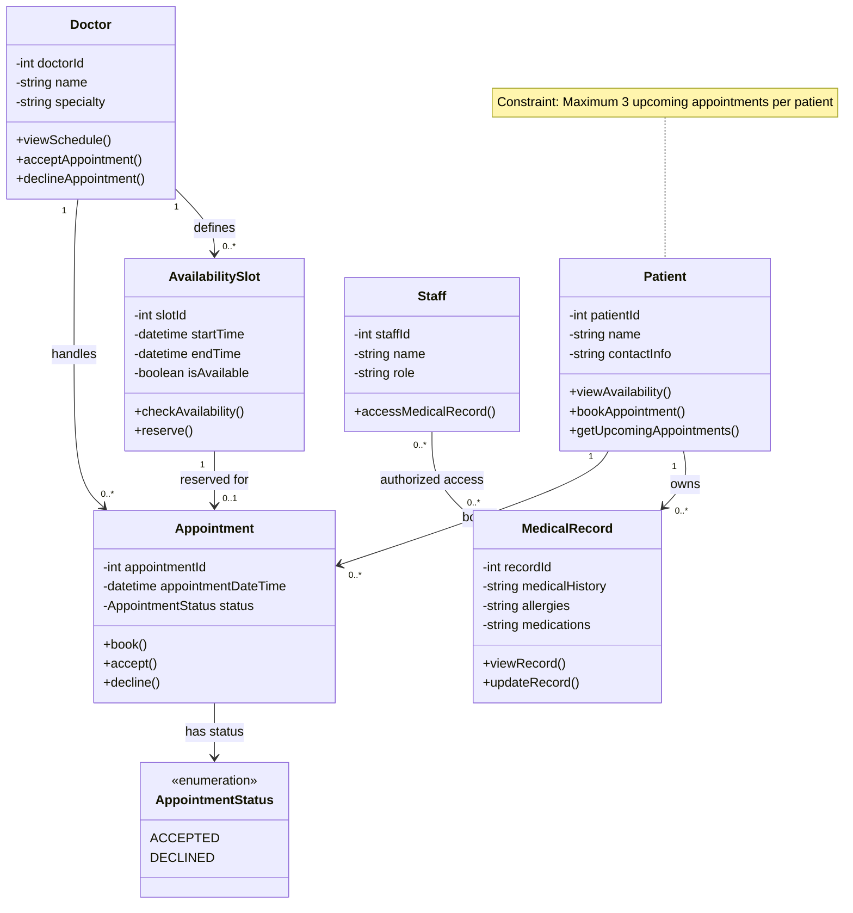

# Clinic Appointments — Class Diagram

```mermaid
classDiagram
    class Patient {
        -int patientId
        -string name
        -string contactInfo
        +viewAvailability()
        +bookAppointment()
        +getUpcomingAppointments()
    }

    class Doctor {
        -int doctorId
        -string name
        -string specialty
        +viewSchedule()
        +acceptAppointment()
        +declineAppointment()
    }

    class Appointment {
        -int appointmentId
        -datetime appointmentDateTime
        -AppointmentStatus status
        +book()
        +accept()
        +decline()
    }

    class AvailabilitySlot {
        -int slotId
        -datetime startTime
        -datetime endTime
        -boolean isAvailable
        +checkAvailability()
        +reserve()
    }

    class AppointmentStatus {
        <<enumeration>>
        ACCEPTED
        DECLINED
    }

    class MedicalRecord {
        -int recordId
        -string medicalHistory
        -string allergies
        -string medications
        +viewRecord()
        +updateRecord()
    }

    class Staff {
        -int staffId
        -string name
        -string role
        +accessMedicalRecord()
    }

    Patient "1" --> "0..*" Appointment : books
    Doctor "1" --> "0..*" Appointment : handles
    Doctor "1" --> "0..*" AvailabilitySlot : defines
    AvailabilitySlot "1" --> "0..1" Appointment : reserved for
    Appointment --> AppointmentStatus : has status
    Patient "1" --> "0..*" MedicalRecord : owns
    Staff "0..*" --> "0..*" MedicalRecord : authorized access

    note for Patient "Constraint: Maximum 3 upcoming appointments per patient"
```
