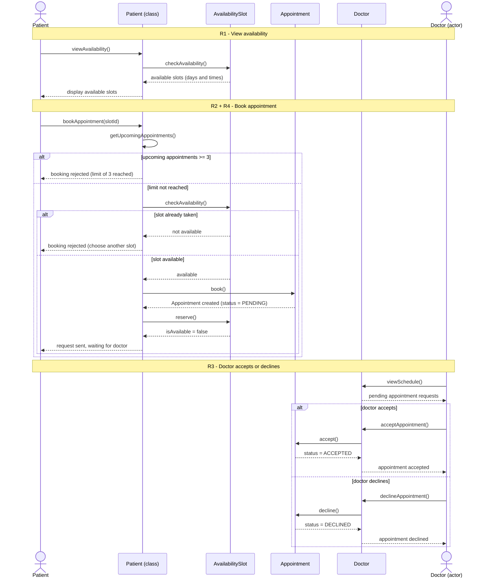

# Clinic Appointments — Sequence Diagram

This diagram models the appointment request and booking process (R1–R4).
Participant and method names follow `class_diagram.md`. The limit N = 3.

```mermaid
sequenceDiagram
    actor P as Patient
    participant Pat as Patient (class)
    participant S as AvailabilitySlot
    participant A as Appointment
    participant Doc as Doctor
    actor D as Doctor (actor)

    Note over P,D: R1 - View availability
    P->>Pat: viewAvailability()
    Pat->>S: checkAvailability()
    S-->>Pat: available slots (days and times)
    Pat-->>P: display available slots

    Note over P,D: R2 + R4 - Book appointment
    P->>Pat: bookAppointment(slotId)
    Pat->>Pat: getUpcomingAppointments()

    alt upcoming appointments >= 3
        Pat-->>P: booking rejected (limit of 3 reached)
    else limit not reached
        Pat->>S: checkAvailability()
        alt slot already taken
            S-->>Pat: not available
            Pat-->>P: booking rejected (choose another slot)
        else slot available
            S-->>Pat: available
            Pat->>A: book()
            A-->>Pat: Appointment created (status = PENDING)
            Pat->>S: reserve()
            S-->>Pat: isAvailable = false
            Pat-->>P: request sent, waiting for doctor
        end
    end

    Note over P,D: R3 - Doctor accepts or declines
    D->>Doc: viewSchedule()
    Doc-->>D: pending appointment requests

    alt doctor accepts
        D->>Doc: acceptAppointment()
        Doc->>A: accept()
        A-->>Doc: status = ACCEPTED
        Doc-->>D: appointment accepted
    else doctor declines
        D->>Doc: declineAppointment()
        Doc->>A: decline()
        A-->>Doc: status = DECLINED
        Doc-->>D: appointment declined
    end
```
