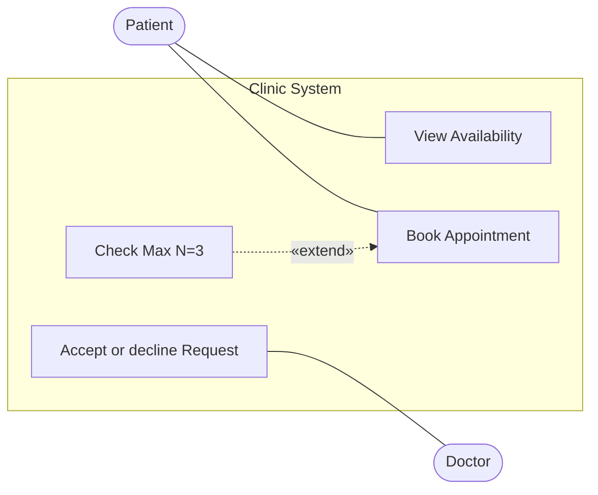

Use Case Diagram

```mermaid
flowchart LR
    P([Patient])
    D([Doctor])

    subgraph Clinic_System["Clinic System"]
        UC1[View Availability]
        UC2[Book Appointment]
        UC3[Accept or decline Request]
        UC4[Check Max N=3]
    end

    P --- UC1
    P --- UC2
    UC3 --- D
    UC4 -.->|"«extend»"| UC2
```
